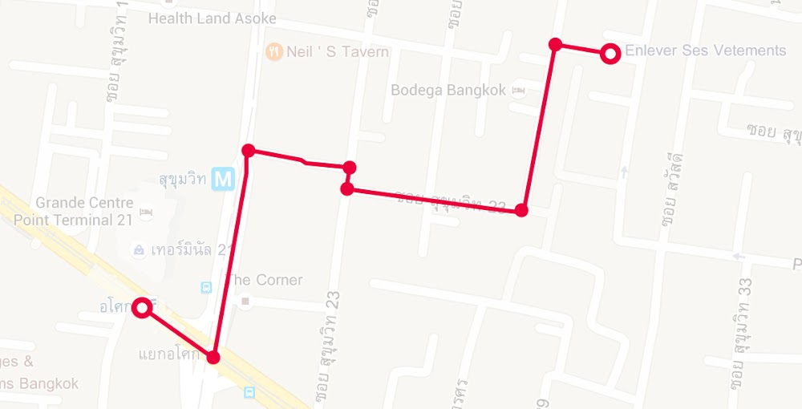
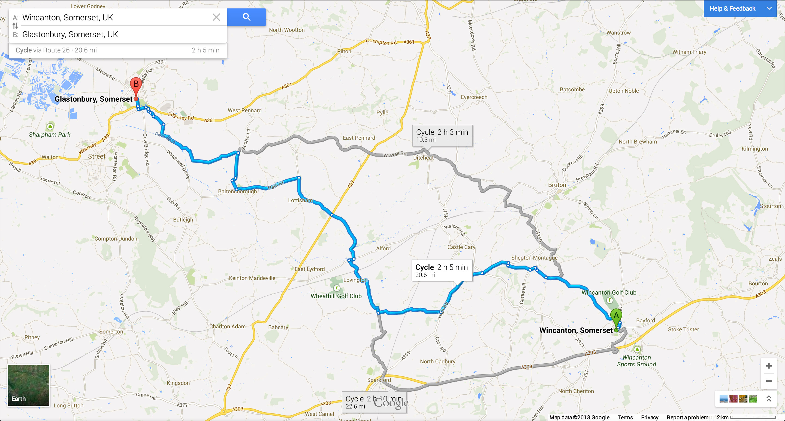

# The Internet 101

At some point in your design or development career, even if it's just on the phone to your ISP \(Internet Service Provider\) to ask why the internet is down or how to setup you email address on your laptop, you'll come across things like IP addresses, domain names and, the already mentioned, ISPs. Instead of just knowing what these are, this chapter will explain what they actually are and how they all work together and, hopefully, give you a better understanding of how the internet works.

The internet is not entirely unlike [Google Maps](https://maps.google.com) \(Street maps and GPS\). Just like when you type a website's address into your browser's address bar, when you search Google Maps for an address, it will, with some transportation in between, direct you there. Though it may feel like it sometimes, the website you are visiting is rarely just a click away. Like a major city's streets, the internet is a massive, complex place and going "just around the corner", may as well, and often is, on the other side of the world.

[http://www.akexorcist.com/2015/12/google-direction-library-for-android-en.html](http://www.akexorcist.com/2015/12/google-direction-library-for-android-en.html)

Driving to our destination above, each dot represents a turn we would have to take. Between you and the website you are visiting are turns too. These turns are called "Routes" and the routing is performed by "Nodes" \(routers, servers or network services\). These nodes work a lot like stoping and asking for directions. Each person sends you a little way towards your destination until you meet another person who can direct you more and so on. Each person giving you the best or fastest route, according to them, until you have arrived at your destination.

You maybe, at one of your stops, asking for directions, be told that there is a road block ahead, so take this alternative route instead. Each node knows the availability of the other nodes it's connected too, making the internet, like the city streets, very diverse. You will, more other than not, be able to get to the website you are looking for regardless of if some nodes are unavailable or down.

[https://www.designedbyross.com/web-insights/new-google-maps-sneak-peek/](#)

Below is a closer look at each at some of the components of networking and the internet that make it possible for you to get from point A, your laptop, to point B, your favourite website. Each section following on the one before so by the end we should have a clear picture of what is actually happening, unseen by us, in those split seconds it takes out page to load.

## URL

A URL should be nothing new to anyone with a smartphone or laptop and an internet connection. It is the address of the website, or other network service, you are trying to reach.

Taken from Wikipedia, every URL follows this basic syntax:

```
scheme:[//[user[:password]@]host[:port]][/path][?query][#fragment]
```

You may, however, be more familiar with a URL in it's most basic form, for example:

```
http://google.com
```

This very simple URL contains the only two parts of the URL syntax that are required: the `scheme` and the `host`.

* `scheme`: (`http`) This is also referred to as the `protocol` . This is directly linked to the Network Service and often implies a default port number. More details in the section to follow.

* `host`: (`google.com`) This is, more often than not, the domain name which will be explained below.


## Network Services & Ports

The website we are visiting lives on a server and because this server's sole purpose is to serve your website to the world, it is classified as a service. Services are strictly defined by what they do, so a service that is made for serving websites cannot deliver your email to you, it wasn't made for that. In other words, each service plays one, specific role. However, to the outside world, we might try to identify the services by what port it is listening on. An email service might listen on the default port that a web service normally listens on and we could mistake it for a website. Upon asking it for a website though, it will won't be able to reply correctly.

We, through our web browser, have pre-ordered takeout. Our GPS has taken us to the takeout place, but we need to confirm that our order is ready and collect it. Because we have made a web request, our takeout order, we know that the person we need to speak to, the service, is a cashier, a web service. So we look at the the staff's name tags and there is only one cashier, the default port number, who happily gives us our meal and we are on our way.

Default port numbers are service specific, but a service doesn't have to use these defaults. Network ports can be any number between 0 and 65535.

We call our order in and speak to Bob, port 80 \(the default port number for web services\). On arrival we see that their name tags have just numbers on them, 0 - 65535. We would have to ask each all 65535 staff members "Are you Bob?" for us to collect our order. Rather than, we can just specify which port we are expecting the web service to be listening on by adding it to the URL.

```
http://google.com:8080
```

By adding `:8080`, `8080` being the port number, right after the host, we are telling the web browser to expect the web service to be listening on port `8080`.

## I.P Addresses

I.P (Internet Protocol) Address are in many ways similar to GPS coordinates. Where GPS coordinates are latitude and longitude seperated by a comma, I.P is 32-bit numeric address with each number ranging from 0 - 255.

IP addresses identify very specific and unique places on the network or the internet. If we had no street names to rely on, a GPS coordinate would be how we would identify Friends of Design for example. This, however, only gets you to the building. You still would need to know which floor or office number to go to. This is how I.P addresses work with network service ports to identify services.

## DNS & Domain Names

Domain names are friendly names given to I.P Adresses to make it easier to find services.

Think about not having any names or pictures fir any phone number on your phone. Having to identify people to call or messaged based on the phone number alone. Your address book or contacts app here becomes your DNS (Domain Name Server) making it possible to link people's names to thier phoine number.

A FQDN (Fully Qualified Domain Name) can be broken down into three main part, from right to left and equally most important: 

- TLD (Top Level Domain) this would be the `com`,  `co.za`, `net` part of the domain name
- SLD (Second Level Domain) this could generally be the actualy descriptive name like `google`, `facebook` and `friendsofdesign` for example
- LLD (Lower Level Domain) this is often refered to as being subdomains and could be something like `www`. There can be more than one of these.

Each of these are seperated by a .(dot) and could look something like these:

- `SLD.TLD` / `google.com`
- `LLD.SLD.TLD` / `www.friendsofdesign.net`
- `LLD.LLS.SLD.TLD` / `beta.app.facebook.com`

A valid domin name only requires a TLD and a SLD, shoud not be a grater than 253 chartecters or contain more than 127 levels (the combination of LLD, SLD and TDL)

