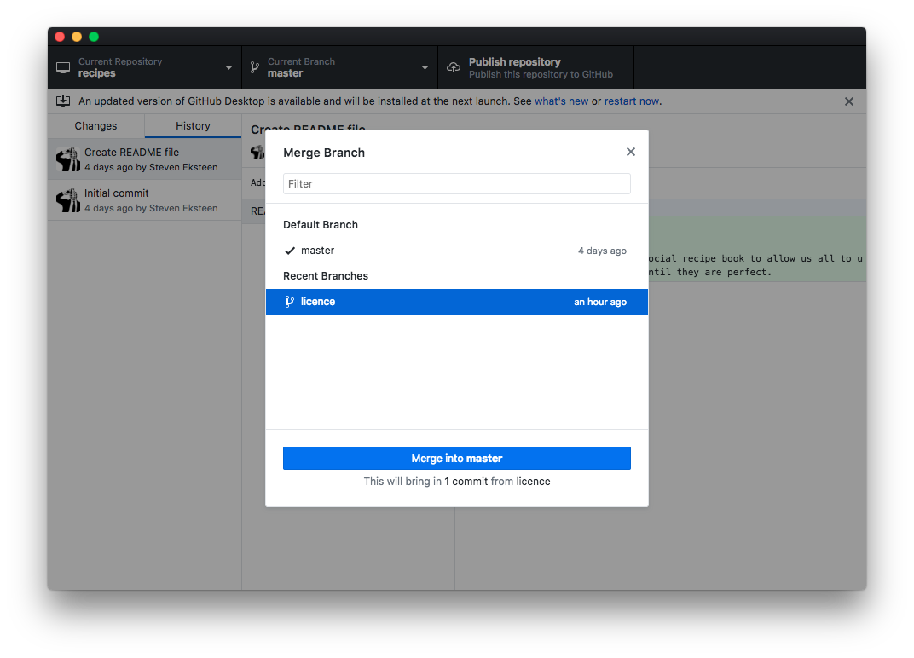

# Working with Git and GitHub

> Having a distributed architecture, Git is an example of a DVCS \(hence Distributed Version Control System\). Rather than have only one single place for the full version history of the software as is common in once-popular version control systems like CVS or Subversion \(also known as SVN\), in Git, every developer's working copy of the code is also a repository that can contain the full history of all changes.

[https://www.atlassian.com/git/tutorials/what-is-git](https://www.atlassian.com/git/tutorials/what-is-git)

While the above link can give an excellent technical explanation about performance and security, as students it may not seem helpful at all. However, it will be a great read once the terminology is broken down.

Git is a Revision Control, although it can be referred to as Version Control sometimes. Like with Markdown, you may not have heard of this before, but you have probably seen it in action. Dropbox, for example, has a feature that allows you to list all the previous changes on a file, this is Revision Control.

Revision Control quite simply just takes the previous version of a file and the new version, compares them, figures out what has been changed and then saves just the changes as a revision. This is done by saving, mainly, just three things: What's been added, what's been removed and what's been modified.

To do this, Git uses a tool called Diff \(short for difference\). There are many standalone Diff tools available, but the following examples have been taken using [Diff Checker](https://www.diffchecker.com/diff), an online Diff tool.

When a new file is created in Git, it is basically just a diff of all additions:


...and similarly, when a file is deleted, it is basically just a diff of all deletions:


When a file is just edited, the diff will contain a list a reference to all characters that have been changed. In extreme cases, if the changes are just too destructive, the entire line or even file will just be automatically replaced with 100% additions:


The major advantage of Git being a Distributed Revision Control System is that these revisions don't just exist on the editors device, but on all editors devices in the for of a repository. In addition to this "backup" also comes the security of not being able to overwrite someone else's changes. Git will determine what changes to overwrite and what to keep from a previous version. IF it cannot automatically fix these conflicts, it will prompt you to do so.

## Git is not GitHub

It is very important to know that, as the title suggests, Git and GitHub are entirely too separate things. Git is a program that runs on a devices \(your laptop or on a server\) while GitHub is a SaaS \(Software as a Service\) that uses Git to create a social code sharing web application. While the confusion may not come in by simply looking at GitHub, it does when we start to use the GitHub Desktop Client. Even though this application is named GitHub, it is actually just an interface for Git.

Git is a command line application. This means that without an interface like the GitHub Desktop application, you would need to be very comfortable using the command line. Going forward, each example will be presented in both the command line and using the GitHub Desktop application.

It is also very important to note that services like GitHub, BitBucket, GitLab etc are **not** required to use Git, but are recommended. These services are essentially the Git Servers that enable the remote \(distributed\) features of Git. If you are just using Git for revisions, then servers are not required.

## Creating revisions

To start using Git, it needs a folder to create a repository in. A repository is where all your files and information regarding the repository will be kept. The all this information is stored in a hidden `.git` folder. This folder should never be removed unless you really want to delete the revision history.

The process of creating a repository is called initialising. This can be done in an empty folder or a folder with existing files. No pre-existing files will be removed or modified.

In GitHub Desktop we can initialise a new repository by using the "Create a New Repository" button and filling in the repository's name. This will automatically create the folder, with the same name as the repository, and initialise a new Git repository.


Using the CLI \(Command Line Interface\), we will have to create the folder first, go into it and then initialise the repository using the `git init` command:


In GitHub Desktop you will be presented with a repository "status" screen. This screen will update automatically with any changes you make to any file within the repository:


This screen, as you will see shortly, is a combination of the CLI commands `git status` and `git diff`


Because the repository/folder is currently empty, both GitHub Desktop and the CLI will show no changes.

A best practice for projects, of any kind, is to create a README file. This file will contain information about your project and. if needed, instructions on how to use it or set it up. Other important information that projects need to have such as the license and contributors can also be included in this file.

Once this file has been created, you will be able to see changes ready to saved into a revision:


GitHub Desktop takes away some of the addition steps required to add a new file into the repository. The CLI, however, is more explicit. It requires you to specify that you want to track a new file. Adding the file to be tracked is how Git knows to save all changes to this file as revisions.


Before we will be able to see the diff from the CLI, we will need to track the file. This can be done on a per file basis by using `git add PATH/TO/FILE` or to quickly add all untracked files `git add .` The `.` here represents the current directory. Adding the entire directory might now be ideal though because the `git add` command also adds changes to the stage. Staging changes is selecting which changes in which files you are going to commit to this revision. If you have made changes to many files, you may not want to commit them all at once because they are unrelated changes. In GitHub Desktop, staging change done by using the checkboxes next the the file name.


Now the diff, like in GitHub Desktop, becomes available using the `git diff --staged`


Committing the changes now saves the revision. Adding a message to the commit gives you the ability to describe the change and/or the reasons behind it. This is very useful for tracking changes. There is a best practise for this called the [50/72](https://medium.com/@preslavrachev/what-s-with-the-50-72-rule-8a906f61f09c) rule.

In GitHub Desktop, this will apply to the "Summary" field, which should be a high level description of the change limited to 50 characters and then, if needed, a more in depth description in the "Description" field, limited to 72 characters.


When using the CLI, you can run `git commit` which will bring up the text editor where you can add your "Summary" and "Description". In the command line a new line will separate the summary from the description, but it is best practise to include a blank line between them.


You can also commit with your message inline using the `-m` switch and then using the `\n` to indicate new lines


Once you have committed to master, more on this later, your stage will be cleared for new changes and a revision created. In GitHub Desktop your revisions can be seen in the "History" tab:


...and from the CLI by using the `git log` command:


## Working with branches

In it's most basic form, working with branches is not unlike copying all the files and folders in your project into a new folder. You might do this so that you can work on the same files without affecting the original files.

In this scenario, the main project folder, where you copied the files from, would be your master branch. The master branch is created when a new Git repository is created. It is generally used for the most stable version of your project- The version that has been fully tested and ready to be a live website or app.

When creating a new branch, you branch off of an existing branch. By default this will be master. A new branch will be an exact copy of the parent branch. All files, folders and the entire commit history will exist in the new branch. Nothing you do to the files in this new branch will affect files in any other branch.


From the CLI we would the command `git checkout -b licence`using `checkout`will switch the branch and if the branch needs to be created, `-b`


The licence is being added into a branch so that we can have the legal department verify the licence before we publish it to the live website by adding it to the master branch.


Once the licence is added and we have commited the change, development can continue on the master branch without having to wait for this change to be bew review. 


From the CLI, the `-b`switch is not required in `git checkout master`because master is an existing branch.


Once a branch is created it is independant of all other branches, even it's parent. Unlike creating a new branch, switching to an existing branch doesn't carry over any changes or commit history.


Bringing changes made in a different branch into the current branch is called merging. Merging branches can be done either way. You can merge changes from the parent branch into the child branch to make sure that you are always working with update-to-date code and this is concidered a must. Once the child branch is up-to-date, the child branch's changes can then be merged into the parent.



From the CLI the `git merge BRANCH_NAME`command will merge all changes from the branch name provided into the the current branch.


Once merged, all the changes made to that branch since the branch was created will be added into the current branch. The changes can then be seen as part of the commit history.


Git merges these changes based on the existing content and what has been changed. Sometimes there can be conficting changes though. For the most part, Git handles these based on when the branch was created relative to the changes in the parent's branch. There are however times where Git cannot automatically resolve these conflicts.


When a conflict does happen, Git will show both the current branch's code and the changes that have tried to be merged. These blocks will show up in file where the conflict has happened.


The conflict block with start with

```
<<<<<<< HEAD
```

The content following this will be the current branch's content. The current branch will always be marked as `HEAD`. The current branch's conflicting content will end with

```
=======
```

The content following this will be the conflicting content that is trying to be merged into the current branch. The conflicting content and the conflict block will end with `>>>>>>>`followed by the name of the branch

```
>>>>>>> licence
```

To resolve the conflict, the entire conflict block needs to be deleted, leaving just the correct content in place and the file saved.


A commit resolving the conflict will then be made, confirming the merging on the branch into the current branch


